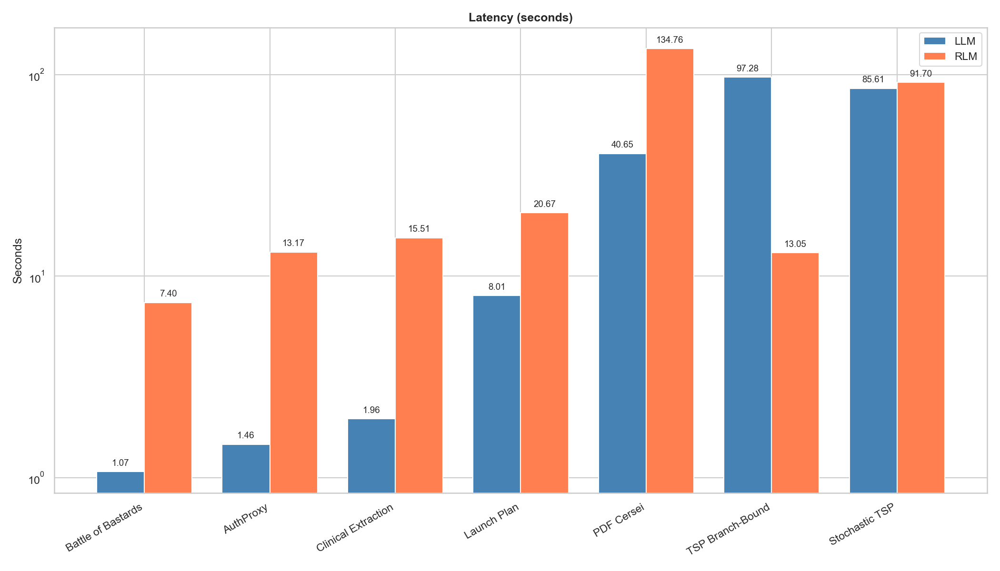
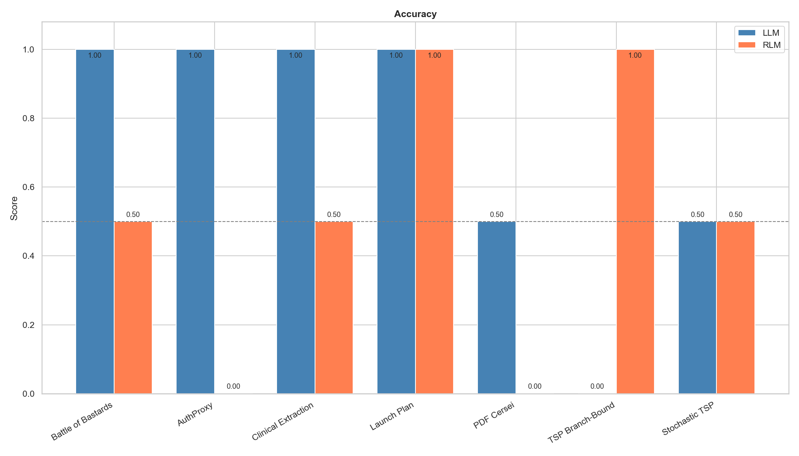
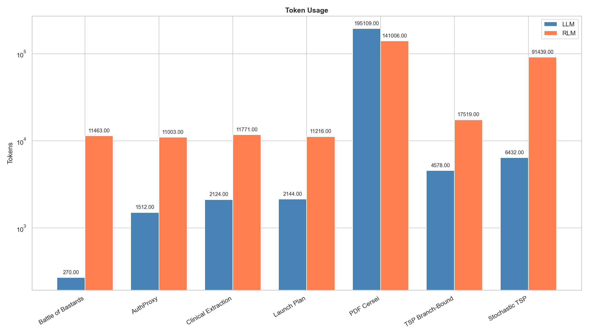
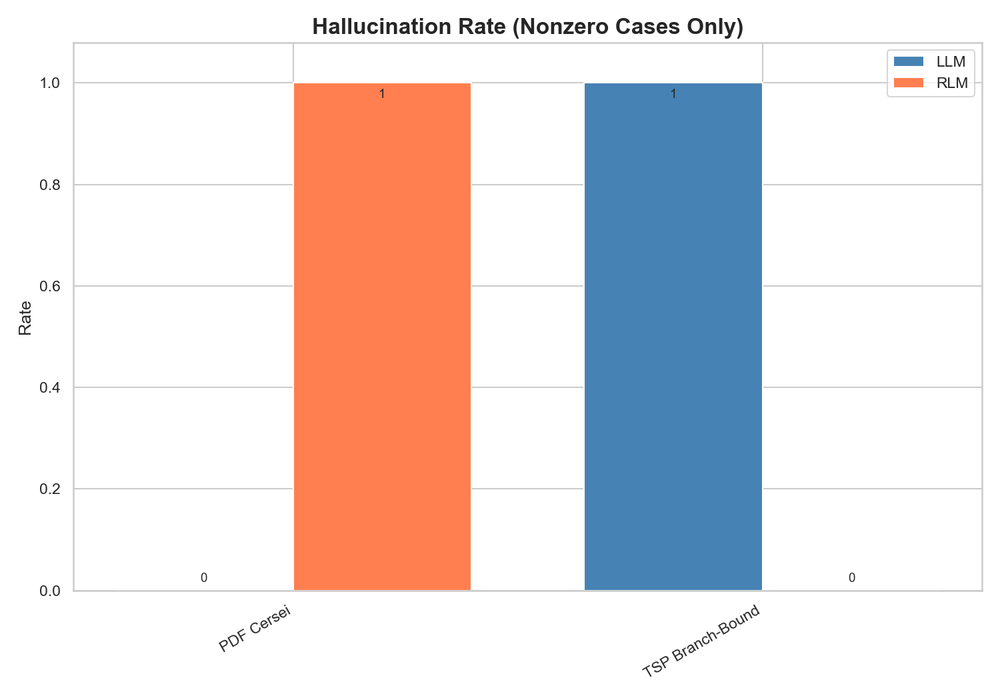
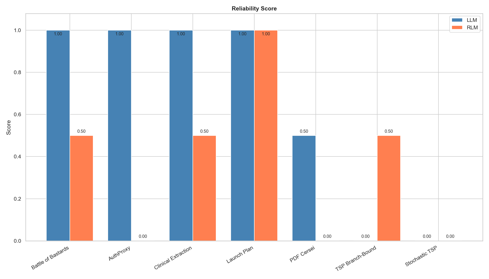
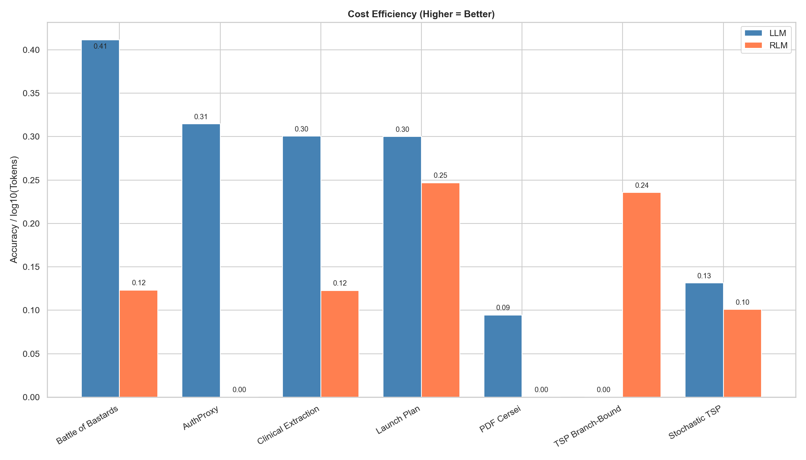
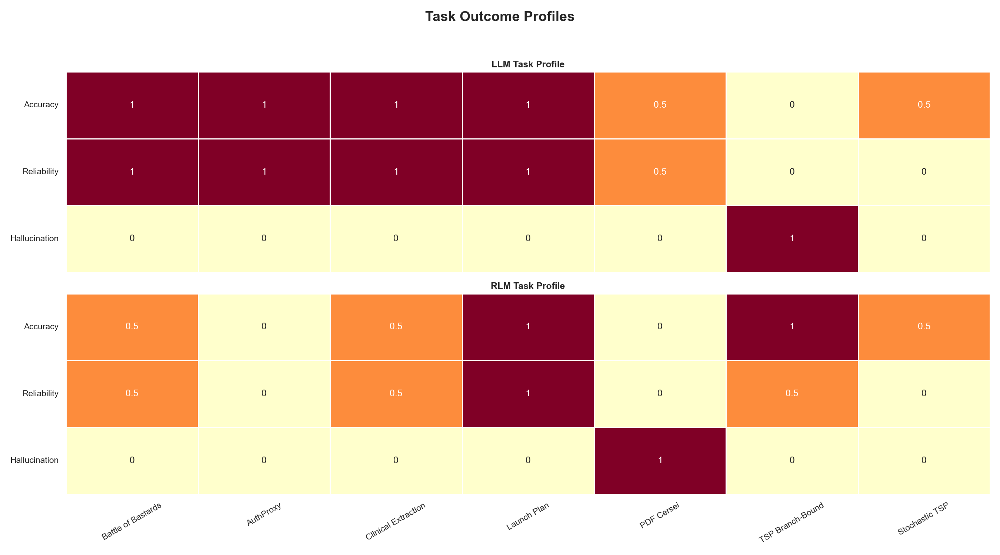
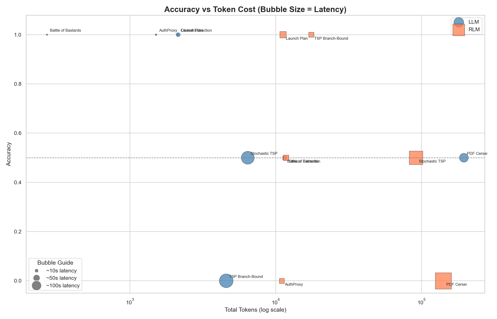
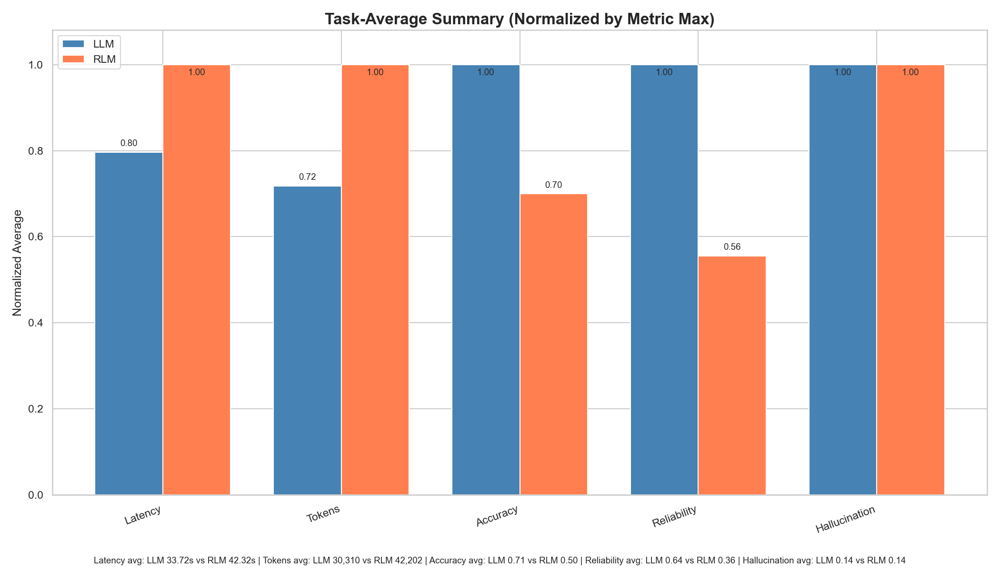

## Abstract

This paper presents a structured empirical comparison between two Gemini-based execution paradigms: direct single-shot prompting (LLM) and agentic reasoning-loop execution through the RLM framework. Seven task families were evaluated, spanning short reasoning, long-context retrieval, structured extraction, planning, PDF question answering, hallucination detection, and stochastic optimization. Performance was analyzed using latency, accuracy, token usage, hallucination rate, reliability, and cost efficiency. Across the matched tasks, direct prompting generally delivered better latency, lower token cost, and stronger answer quality. RLM's clearest advantage appeared on under-specified prompts, where iterative decomposition and explicit intermediate checking made grounded refusal more likely than fabrication. The PDF-based comparison is retained for descriptive completeness, but it is not treated as a clean head-to-head result because the two paths operated on different input representations. The findings therefore support direct prompting as the default strategy for standard retrieval, extraction, and planning workloads, while reserving agentic frameworks for settings where missing-information detection, self-correction, or reasoning trace visibility is operationally important. The main limitations are small sample sizes, the absence of independent inter-rater agreement measurement, discrete legacy scoring labels, and configuration variability across RLM runs.

## 2. Literature Survey

### 2.1 Recursive and Structured Reasoning Architectures

Prior work on recursive and tree-structured neural models established the broader intuition that hierarchical decomposition can improve representation quality when tasks are naturally compositional. Tree-LSTM, recursive autoencoder, and recursive tensor-network style models demonstrated that explicitly structured computation can outperform flat sequential processing on sentiment, semantic relatedness, and logical inference benchmarks when the target problem contains nested dependencies. More recent agentic frameworks extend that same principle from representation learning to inference-time control flow: instead of merely encoding structure in hidden states, they externalize structure as intermediate plans, sub-goals, tool calls, or spawned reasoning threads. This lineage is directly relevant to RLM, whose core promise is not stronger base-model knowledge, but better execution discipline on tasks that benefit from decomposition, checking, and iterative refinement.

### 2.2 Agentic Memory and Long-Context Systems

A second strand of literature studies how language models cope with contexts that exceed the practical limits of a single forward pass. Systems such as MemGPT argue that long-context performance is often a systems problem rather than a pure architecture problem: performance depends on what is retained in working memory, what is externalized, and how retrieval is coordinated across steps. Related work on infinite-context and compressed-memory transformers similarly treats long-range reasoning as a problem of memory budgeting and selective retention. These contributions are relevant because RLM, like other agentic runtimes, pays an execution tax in exchange for memory management flexibility. The benchmark tasks in this report therefore test not only model intelligence, but also whether iterative orchestration helps or harms performance relative to a direct full-context call.

### 2.3 Long-Context Evaluation and the Retrieval Problem

Recent evaluation work has also cautioned that many so-called long-context benchmarks are dominated by retrieval rather than by genuine multi-step synthesis. This distinction matters for the present comparison. If a task is principally a high-recall extraction problem, a direct prompt that places the full document in context may outperform a multi-step agent that repeatedly serializes, filters, or re-queries the same evidence. In such settings, additional planning can become overhead rather than capability. By contrast, under-specified problems, ambiguous requirements, or tasks that reward explicit verification may benefit from iterative control logic. This literature provides a useful conceptual frame for interpreting why the direct LLM path wins several retrieval-heavy tasks in this study while RLM's main success appears on the hallucination benchmark.

### 2.4 Reliability, Grounding, and Failure Surfaces

A recurring theme in the literature on tool-augmented and multi-step agents is that extra reasoning structure introduces both benefits and new failure modes. On the positive side, intermediate traces improve observability, make refusals more principled, and create opportunities for self-correction. On the negative side, every additional loop, tool invocation, or decomposition step can introduce latency, state drift, formatting errors, and failure propagation from an early bad decision. This trade-off is central to the present report. The empirical question is not whether recursive reasoning is intrinsically superior, but under what conditions its additional control structure produces enough grounding benefit to justify its operational cost.

### 2.5 Research Gap

The existing literature provides strong conceptual arguments for structured reasoning, long-context memory management, and recursive computation, but it does not by itself answer a practical deployment question: when should a team prefer direct prompting over an agentic runtime for ordinary product workloads? Most prior work evaluates specialized benchmarks or introduces new frameworks, rather than comparing single-shot and recursive execution on the same family of applied tasks with common logs, common metrics, and explicit attention to latency and token cost. There is therefore a gap between architectural promise and operational guidance.

### 2.6 Position of the Present Study

This report addresses that gap through a small but concrete benchmark suite spanning retrieval, extraction, planning, hallucination resistance, and optimization. The contribution is not a new agent architecture. Instead, it is an execution-level comparison between direct Gemini prompting and RLM-mediated runs using saved repository logs as the evidence base. The study is intentionally practical: it asks when recursive structure materially helps, when it introduces unnecessary overhead, and how those trade-offs appear across latency, cost, answer quality, reliability, and grounding behavior.

\newpage

---

# LLM vs RLM Benchmark Report

> A structured comparison of direct Gemini API calls (LLM) against RLM-driven agentic runs across seven task families.

---

## Table of Contents
1. [Overview](#overview)
2. [What We Did](#what-we-did)
3. [Tasks Tested](#tasks-tested)
4. [Metrics Used](#metrics-used)
5. [Raw Data](#raw-data)
6. [Results by Task](#results-by-task)
7. [Graph Explanations](#graph-explanations)
8. [Cross-Task Findings](#cross-task-findings)
9. [Where RLM Wins](#where-rlm-wins)
10. [Where LLM Wins](#where-llm-wins)
11. [Limitations](#limitations)
12. [Conclusion](#conclusion)

---

## 1. Overview

This report documents a head-to-head comparison between two approaches to running Gemini-based AI tasks:

- **LLM path**: Direct calls to `google.generativeai` with a single prompt and a single response.
- **RLM path**: Agentic runs using the `rlm` library, which adds iterative reasoning, REPL access, tool use, and optional recursion.

All raw timings, token counts, and benchmark findings used in this report are sourced from the saved `.md` log files inside `llm-test/` and `rlm-test/` in the repository. The qualitative scores and composite metrics in this report are derived from those saved log outcomes.

The graphs generated alongside this report visualize six metrics across all seven tasks to make the tradeoffs between the two approaches immediately visible.

---

## 2. What We Did

### Step 1 — Chose seven representative task families
We selected tasks that stress different capabilities: short reasoning, long-context retrieval, structured extraction, planning, PDF question answering, hallucination resistance, and stochastic optimization.

### Step 2 — Built parallel test harnesses
For each task, we wrote two scripts:
- One under `llm-test/` making a direct Gemini call.
- One under `rlm-test/` running the same prompt through RLM.

### Step 3 — Saved all outputs as markdown logs
Every run was saved as a `.md` file. These files are the source of truth for all numbers in this report.

### Step 4 — Scored outputs manually
Because tasks differ in structure, we initially scored each run with legacy discrete labels:
- `1.0` = fully correct or complete output
- `0.5` = partial, wrong speaker, or missing field
- `0.0` = crash, loop, wrong task, or fabricated answer

These legacy labels are preserved in the raw tables for comparability with the original logs, but they are too coarse for a mature evaluation protocol. Section 4 therefore introduces a transparent continuous-rubric proposal that should replace this scale in future rescoring.

### Step 5 — Extracted timing and token counts from logs
Wall time and token counts were read directly from the saved `.md` logs. RLM logs report both wall time and execution time separately; we used wall time for consistency.

### Step 6 — Derived composite metrics
We computed two additional metrics not directly in the logs:
- **Hallucination Rate**: binary flag per task, set to `1` only when the logs explicitly support fabricated or unsupported guessed content.
- **Cost Efficiency**: `Accuracy / log10(Total Tokens)`, a composite score rewarding correct answers achieved with fewer tokens.

### Step 7 — Generated graphs
Multiple matplotlib figures were generated from the hardcoded data. The report includes:
- one standalone chart per benchmark metric
- a task-profile heatmap
- an accuracy-vs-token efficiency frontier
- a normalized task-average summary chart

---

## 3. Tasks Tested

| # | Task | Domain | Key Challenge |
|---|------|--------|---------------|
| 1 | Battle of the Bastards | Short reasoning | Ally identification from fiction |
| 2 | AuthProxy Long-Context | Retrieval | 5 questions from a noisy long document |
| 3 | Clinical Extraction | Structured extraction | Exact fields, exact sentence, step-by-step conclusion |
| 4 | Launch Note App | Planning | 30-day structured launch plan |
| 5 | PDF Cersei Warning | PDF QA | Exact quote, correct speaker, large context |
| 6 | TSP Branch-and-Bound | Hallucination detection | Under-specified prompt, missing distance matrix |
| 7 | Stochastic Adaptive TSP | Optimization | Fully specified stochastic policy, exact expected cost |

The PDF Cersei task is retained for descriptive completeness, but it is not a clean matched comparison. The direct LLM path consumed the original PDF, while the RLM path operated on converted text. The task therefore remains useful for reporting failure modes, but it should not carry the same weight as the other head-to-head tasks in aggregate claims.

---

## 4. Metrics Used

### 4.0 Scoring Protocol and Proposed Continuous Rubric

The repository logs were originally summarized with a three-level scale (`0.0`, `0.5`, `1.0`) for accuracy and reliability. Those values are kept in the raw tables because they were used in the original plots and report drafts. However, this scheme is too coarse for a mature benchmark because it compresses materially different failure modes into the same bucket.

This report therefore treats the discrete labels as legacy placeholders and recommends a continuous rescoring rubric for future versions:

| Band | Accuracy interpretation |
|------|-------------------------|
| 0.90-1.00 | Fully correct, complete, and appropriately grounded |
| 0.70-0.89 | Mostly correct with minor omission or formatting loss |
| 0.40-0.69 | Materially partial result with substantial missing content |
| 0.10-0.39 | Wrong but still task-related output |
| 0.00-0.09 | Unusable result, crash, task drift, or fabricated answer |

| Band | Reliability interpretation |
|------|----------------------------|
| 0.90-1.00 | Clean execution with no visible instability |
| 0.70-0.89 | Small execution issues without affecting final usability |
| 0.40-0.69 | Noticeable instability, retries, or degraded completion |
| 0.10-0.39 | Severe instability with limited usable output |
| 0.00-0.09 | Execution failed or final result is operationally unusable |

No independent second scorer was used in this draft, and no inter-rater agreement statistic is reported. A stronger evaluation should rescore at least a substantial subset of outputs with a second reviewer and report agreement explicitly.

### 4.1 Latency (seconds)
Wall-clock time from script start to final output. Sourced directly from log files.
Lower is better.

### 4.2 Accuracy Score
Legacy qualitative correctness score assigned per run after reading the saved log output. The current tables retain the original discrete labels for comparability, but the continuous rubric above is the recommended replacement for future rescoring.

| Score | Meaning |
|-------|---------|
| 1.0 | Legacy placeholder for a fully correct or complete result |
| 0.5 | Legacy placeholder for a materially partial result |
| 0.0 | Legacy placeholder for an unusable or failed result |

Higher is better.

### 4.3 Token Usage (total tokens)
Sum of input and output tokens per run as recorded in the log files.
Lower is better for equivalent accuracy.

### 4.4 Hallucination Rate
Binary flag per task:
- `1` = the logs explicitly support fabricated or unsupported guessed content
- `0` = the run may still be wrong or unstable, but there is not enough evidence to call it fabricated

Lower is better.

### 4.5 Reliability Score
Legacy qualitative stability score assigned per run. As with accuracy, these discrete labels are retained for comparability with the original draft, but they should be replaced by the continuous rubric above in a revised evaluation.

| Score | Meaning |
|-------|---------|
| 1.0 | Legacy placeholder for a clean and stable run |
| 0.5 | Legacy placeholder for a degraded but partially usable run |
| 0.0 | Legacy placeholder for a severe execution failure |

Higher is better.

### 4.6 Cost Efficiency (composite)
Formula: `Accuracy / log10(Total Tokens)`

This rewards systems that achieve correct answers without spending large token budgets. A system that scores 1.0 accuracy using 270 tokens scores much higher than one that scores 1.0 using 195,000 tokens.

Higher is better.

---

## 5. Raw Data

### Latency (seconds)

| Task | LLM | RLM |
|------|-----|-----|
| Battle of Bastards | 1.07 | 7.40 |
| AuthProxy | 1.46 | 13.17 |
| Clinical Extraction | 1.96 | 15.51 |
| Launch Plan | 8.01 | 20.67 |
| PDF Cersei | 40.65 | 134.76 |
| TSP Branch-and-Bound | 97.29 | 13.05 |
| Stochastic TSP | 85.61 | 91.70 |

### Accuracy Score

| Task | LLM | RLM |
|------|-----|-----|
| Battle of Bastards | 1.0 | 0.5 |
| AuthProxy | 1.0 | 0.0 |
| Clinical Extraction | 1.0 | 0.5 |
| Launch Plan | 1.0 | 1.0 |
| PDF Cersei | 0.5 | 0.0 |
| TSP Branch-and-Bound | 0.0 | 1.0 |
| Stochastic TSP | 0.5 | 0.5 |

### Token Usage (total tokens)

| Task | LLM | RLM |
|------|-----|-----|
| Battle of Bastards | 270 | 11,463 |
| AuthProxy | 1,512 | 11,003 |
| Clinical Extraction | 2,124 | 11,771 |
| Launch Plan | 2,144 | 11,216 |
| PDF Cersei | 195,109 | 141,006 |
| TSP Branch-and-Bound | 4,578 | 17,519 |
| Stochastic TSP | 6,432 | 91,439 |

### Hallucination Rate

| Task | LLM | RLM |
|------|-----|-----|
| Battle of Bastards | 0 | 0 |
| AuthProxy | 0 | 0 |
| Clinical Extraction | 0 | 0 |
| Launch Plan | 0 | 0 |
| PDF Cersei | 0 | 1 |
| TSP Branch-and-Bound | 1 | 0 |
| Stochastic TSP | 0 | 0 |

### Reliability Score

| Task | LLM | RLM |
|------|-----|-----|
| Battle of Bastards | 1.0 | 0.5 |
| AuthProxy | 1.0 | 0.0 |
| Clinical Extraction | 1.0 | 0.5 |
| Launch Plan | 1.0 | 1.0 |
| PDF Cersei | 0.5 | 0.0 |
| TSP Branch-and-Bound | 0.0 | 0.5 |
| Stochastic TSP | 0.0 | 0.0 |

### Cost Efficiency (Accuracy / log10 Tokens)

---

## 6. Results by Task

### Task 1 — Battle of the Bastards
**Winner: LLM**
LLM answered correctly in ~1 second using ~270 tokens across two runs. RLM reached the right answer in one run but crashed during reporting in a second run and answered a completely unrelated tennis prompt in a third run. The short-reasoning task strongly favors direct prompting.

### Task 2 — AuthProxy Long-Context Retrieval
**Winner: LLM**
LLM answered all five questions correctly in 1.46 seconds using 1,512 tokens. RLM consumed 13.17 seconds and 11,003 tokens and collapsed to a single wrong value. Extra agent machinery provided no retrieval benefit here.

### Task 3 — Clinical Extraction
**Winner: LLM**
LLM produced the full expected structure across all five questions. RLM preserved Q1–Q3 and Q5 but left Q4 blank. Both ran without hallucination, but LLM was 8x faster and used 5x fewer tokens.

### Task 4 — Launch Note App Planning
**Draw**
Both paths produced usable 30-day launch plans. LLM was faster and cheaper. RLM output was longer and still serviceable. No clear quality advantage justified the extra RLM cost.

### Task 5 — PDF Cersei Warning
**Descriptive only; not used for strong aggregate comparison**
LLM returned a quote from the wrong speaker (Ned, not Cersei). RLM looped, hit a NameError, and emitted the string "result" as its final answer. This remains an informative failure case, but it is not a clean head-to-head benchmark because the LLM path consumed the original PDF while the RLM path used converted text. The task is therefore reported descriptively rather than treated as a matched comparison.

### Task 6 — TSP Branch-and-Bound (Hallucination Benchmark)
**Winner: RLM**
The prompt was intentionally under-specified with no distance matrix. The correct answer is to refuse. LLM invented a full distance matrix, performed fake branch-and-bound reasoning, and reported a fabricated optimal tour. RLM consistently recognized the missing data and refused to fabricate a solution, though at much higher token cost.

### Task 7 — Stochastic Adaptive TSP
**Neither path is trustworthy yet**
LLM standalone claimed expected cost 32.5563. LLM in the paired harness claimed 20.375. RLM claimed 22.7188. The README gives a verified reference answer of 22.75, and none of the saved runs match it exactly. The main result here is instability across both paths.

---

## 7. Graph Explanations

### Figure A — Latency

Shows wall-clock time per task on a log scale. RLM is slower on every task except TSP Branch-and-Bound, where the LLM run spent a long time hallucinating a fake solution while RLM quickly refused.

### Figure B — Accuracy Score

Shows legacy qualitative correctness per task. Excluding the non-comparable PDF task, LLM leads on most matched tasks, while RLM's clearest win is TSP Branch-and-Bound. Stochastic TSP remains partial and unstable for both paths.

### Figure C — Token Usage

Shows total token consumption per run on a log scale. RLM consistently uses more tokens on the matched tasks. The PDF Cersei task is not directly comparable because the LLM path uploaded the original PDF while the RLM path read converted text.

### Figure D — Hallucination Rate

Binary flags showing only cases with explicit evidence of fabricated or unsupported guessed content. Under this stricter rubric, the clearest LLM hallucination case is TSP Branch-and-Bound, where the model invented a distance matrix and fake solution. The clearest RLM hallucination case is PDF Cersei, where the run looped over unsupported guessed quotes and produced invalid final output. Wrong or unstable outputs without clear fabrication evidence are not marked as hallucinations.

### Figure E — Reliability Score

Shows execution stability. LLM is more stable on standard tasks. RLM shows crashes, task drift, NameErrors, and quota failures across multiple runs. Neither path is reliable on the PDF or optimization tasks.

### Figure F — Cost Efficiency

Composite metric rewarding correct answers achieved cheaply. Failed runs with 0.0 accuracy also score 0.0 here. On the matched tasks, LLM dominates because it achieves equal or higher accuracy at dramatically lower token counts. RLM scores higher on TSP Branch-and-Bound because it answered correctly while LLM scored zero.

### Figure B — Task profile heatmap

This heatmap compresses three qualitative signals per task: accuracy, reliability, and hallucination. It makes the pattern visible quickly: LLM is stronger on standard tasks, while RLM stands out mainly on the under-specified TSP hallucination benchmark.

### Figure C — Accuracy vs token efficiency frontier

This scatter plot shows accuracy against total token cost, with bubble size representing latency. It makes the main economic tradeoff visible: LLM clusters further left at lower token cost, while RLM usually pays a large token and latency premium for similar or worse accuracy.

### Figure D — Task-average summary

This chart normalizes simple task-average values for latency, tokens, accuracy, reliability, and hallucination. It is only a summary view, but it helps confirm the broad pattern already visible in the task-level charts: LLM wins on speed and cost, while RLM's clearest advantage is grounded refusal on the under-specified TSP task.

---

## 8. Cross-Task Findings

- **Speed**: Across the matched tasks, LLM is faster on every task except TSP Branch-and-Bound, where the hallucinating LLM run was slower than the RLM refusal.
- **Token cost**: Across the matched tasks, LLM is consistently cheaper. The PDF task is excluded from that claim because the inputs were not equivalent.
- **Accuracy**: On the matched tasks, LLM leads on most standard retrieval, extraction, and planning workloads. RLM's clearest win is TSP Branch-and-Bound.
- **Hallucination resistance**: RLM is more grounded on under-specified prompts. LLM is generally stronger on well-specified tasks where correctness is driven by direct retrieval or structured completion rather than refusal behavior.
- **Reliability**: LLM is more stable on standard tasks. RLM adds crash risk through NameErrors, task drift, logging failures, and quota interruptions.
- **Observability**: RLM traces make intermediate reasoning and failure points visible. LLM logs show only input and output.

### Mechanistic Interpretation

RLM helps on hallucination-sensitive tasks because it externalizes intermediate reasoning. On an under-specified prompt, that structure creates opportunities to notice missing premises, query for absent information, or terminate with a refusal rather than forcing a single-shot completion. In practice, the TSP Branch-and-Bound benchmark appears to benefit from exactly this behavior: the agentic path treats missing data as a blocking condition, while the direct prompt path proceeds to fabricate a solution.

The same structure hurts retrieval-heavy tasks for the opposite reason. When the task is mostly "read the provided context and return the right spans or fields," decomposition introduces serial overhead, more chances to drop relevant evidence between steps, and more execution surfaces where formatting or control-flow can fail. A direct long-context prompt keeps the full document and the answer request in one inference pass, which reduces coordination cost. This is the most plausible mechanism behind LLM's stronger performance on AuthProxy and Clinical Extraction despite RLM having access to more elaborate reasoning machinery.

---

## 9. Where RLM Wins

- **Under-specified prompts**: When required data is missing, RLM more consistently notices and refuses instead of fabricating.
- **Debugging and observability**: RLM logs expose step-by-step reasoning, tool calls, and intermediate failures that LLM logs hide.
- **Tasks requiring iterative verification**: When the task needs the agent to check its own work across multiple steps, RLM's structure provides a natural scaffold.

---

## 10. Where LLM Wins

- **Short reasoning tasks**: Direct prompting solves them correctly in ~1 second with ~270 tokens.
- **Long-context retrieval**: Single-shot prompting with the full document outperformed agentic retrieval on both long-context tasks.
- **Structured extraction**: LLM produced complete structured output; RLM dropped a required field.
- **Latency-sensitive use cases**: RLM adds 3x to 10x latency on most tasks.
- **Token budget constrained use cases**: RLM uses 5x to 15x more tokens on most tasks.
- **Cost efficiency overall**: On the matched tasks, LLM achieves higher accuracy per token except on TSP Branch-and-Bound.

---

## 11. Limitations

- **Small sample size**: Most tasks have only one or two logged runs per path. Single-run results are not statistically robust.
- **No inter-rater agreement reported**: This draft does not include a second independent scorer or a Cohen's kappa estimate. Subjective scores should therefore be treated as provisional.
- **Discrete legacy scoring**: Accuracy and reliability are still reported with inherited `0.0/0.5/1.0` labels. A continuous rescoring pass would provide better resolution and should replace the current coarse buckets in a revised version.
- **Stochastic TSP evidence is still limited**: The README provides a verified reference answer of 22.75, but none of the saved runs hit it exactly and one baseline log is truncated mid-output.
- **API instability**: Several RLM runs were interrupted by 429, 503, or 504 errors from the Gemini API. These were provider failures, not reasoning failures.
- **PDF comparison is non-comparable for aggregate claims**: LLM uploaded GOT.pdf directly while RLM read a converted `.txt` file. Token counts, evidence presentation, and context boundaries differ, so this task should be interpreted descriptively rather than as a clean benchmark row.
- **RLM configuration varied**: max_iterations, max_depth, recursion limits, and tool availability changed across experiments. Results reflect specific configurations, not RLM in general.
- **Cersei task investigation is ongoing**: The final harness configuration was not fully evaluated before the repo was saved.

---

## 12. Conclusion

Based on the saved `.md` logs in this repository, and excluding the non-comparable PDF task from strong aggregate claims:

**Direct Gemini prompting is the better default** for latency, token efficiency, and answer reliability across the matched tasks in this study.

**RLM is the better choice** when the prompt is intentionally or accidentally under-specified and hallucination resistance matters more than speed or cost, or when observability into intermediate reasoning steps is required for debugging.

**Neither path is reliable enough yet** on tasks requiring exact optimization under uncertainty (Stochastic TSP), and the PDF Cersei task remains a descriptive failure case rather than a fair matched benchmark.

The clearest practical takeaway is:

> Use direct prompting by default. Add RLM when you need the agent to catch its own errors, inspect missing information, or when you need a trace of intermediate steps for debugging.

---

*Generated from log files in `llm-test/` and `rlm-test/`. Raw timings and token counts come from saved `.md` artifacts. Accuracy and reliability values remain legacy qualitative scores pending a continuous rescoring pass and independent agreement check.*

\newpage

## 6. Future Scope and Proposed Architectural Changes

While the current Recursive Language Model (RLM) architecture demonstrates significant promise in handling complex multi-step reasoning tasks, several limitations and avenues for improvement have been identified. This section outlines future research directions and concrete architectural enhancements that can increase the robustness, reliability, and practical deployability of RLMs.

### 6.1 Bounded Recursion and Adaptive Mode Selection for Production Deployments

One of the most pressing challenges in deploying RLMs in production environments is the unbounded nature of recursive LLM calls. In the current architecture, the depth of recursion is determined entirely by the model's internal decomposition logic, which can lead to unpredictable latency, escalating API costs, and degraded user experience in time-sensitive applications.

To address this, two complementary mechanisms are proposed:

- Hard Recursion Limits: A configurable maximum recursion depth parameter (`max_depth`) should be enforced at the runtime level. Once this threshold is reached, the system should gracefully collapse the partial reasoning chain into the best available response, rather than failing or looping indefinitely. This ensures predictable worst-case latency guarantees that are essential for SLA-bound services.
- Adaptive Mode Selector: Before initiating a recursive chain, a lightweight task-complexity classifier should evaluate the user query and route it to either a standard single-pass LLM call or the full RLM pipeline. Simple, well-scoped queries -- factual lookups, short summarizations, direct Q&A -- do not justify the overhead of recursive decomposition and should be served with a plain LLM response. Only tasks exhibiting multi-step dependencies, ambiguous sub-goal structure, or high semantic complexity should trigger the RLM pipeline.

This dual-mode approach not only reduces unnecessary computation but also gives end users and system administrators explicit control over the latency-quality tradeoff, configurable per deployment environment or even per user tier.

### 6.2 Integration of Axon MCP Server for Codebase-Aware Reasoning

A significant limitation of current RLMs -- and LLMs broadly -- when applied to software engineering tasks is the lack of deep, structural understanding of the codebase they are reasoning over. Models receive flat text snippets as context, which strips away the rich relational information embedded in real-world codebases: call graphs, inheritance hierarchies, service dependencies, and API contracts.

Axon MCP Server ([https://github.com/ali-kamali/Axon.MCP.Server](https://github.com/ali-kamali/Axon.MCP.Server)) is an open-source Model Context Protocol (MCP) server designed to bridge this gap. It transforms an entire codebase into an intelligent, queryable knowledge graph by combining syntactic parsing (Tree-sitter, supporting Python, JavaScript, TypeScript, and C#) with compiler-grade semantic analysis via the Roslyn framework for C# projects. The parsed codebase is stored in a PostgreSQL database augmented with `pgvector` for semantic vector search, and exposed to AI assistants through a standardized MCP interface.

Integrating Axon into the RLM architecture offers the following advantages:

- Each recursive sub-goal can query Axon's semantic index rather than relying on raw file contents injected into the context window, dramatically improving the signal-to-noise ratio of retrieved code context.
- Axon's call graph and inheritance tools allow the RLM to reason about impact and dependencies across files -- a capability that is impossible with flat context retrieval.
- Entity Framework mappings exposed by Axon enable RLM reasoning chains that involve database schema understanding without manual schema injection.
- Axon's sub-500ms p95 query latency ensures that codebase lookups do not become the bottleneck in the recursive chain.

Future work should explore tight coupling between the RLM's sub-goal planner and Axon's 12 MCP tools (`search`, `get_call_graph`, `get_api_endpoints`, `find_implementations`, and others), effectively giving each recursion step structured access to the architectural knowledge of the codebase rather than unstructured text.

### 6.3 Mitigating First-Call Hallucination Propagation

The RLM's output quality is fundamentally coupled to the fidelity of its first LLM call. This initial call is responsible for decomposing the user's query into a structured plan of sub-goals that drives all subsequent recursion. If the model misinterprets the query, over-decomposes it, or halluccinates a sub-goal that has no grounding in the actual task, this error propagates and compounds through every downstream recursive step -- a phenomenon we term first-call hallucination propagation.

This structural vulnerability calls for several targeted mitigations:

- Decomposition Verification Layer: Before executing the recursive chain, an independent validation step should assess whether each generated sub-goal is semantically coherent, non-redundant, and genuinely derivable from the original query. This can be implemented as a lightweight secondary LLM call with a strict verification prompt, or as a deterministic rule-based checker for common decomposition anti-patterns.
- Confidence-Gated Execution: The initial decomposition call should produce not only sub-goals but also a confidence score or uncertainty estimate for each. Sub-goals below a configurable confidence threshold should either be flagged for user review (see Section 6.4) or collapsed into a single direct LLM pass, avoiding deep recursion on uncertain foundations.
- Grounded Decomposition with Retrieved Context: Integrating retrieval-augmented generation (RAG) at the decomposition stage -- for instance using Axon's semantic search to ground the first call in relevant codebase context -- can substantially reduce the likelihood of hallucinated sub-goals by ensuring the model's decomposition is anchored to verifiable facts.

Addressing first-call hallucination is arguably the highest-priority robustness improvement for the RLM architecture, as no amount of downstream correction can fully compensate for a fundamentally flawed initial decomposition plan.

### 6.4 Human-in-the-Loop Thinking Direction Control

The current RLM architecture operates as a fully autonomous pipeline: once a query is submitted, the model's decomposition and recursion proceed without any opportunity for user course-correction. While this is efficient for well-scoped tasks, it becomes problematic for ambiguous, open-ended, or high-stakes queries where the decomposition direction can legitimately vary based on user intent.

We propose introducing a human-in-the-loop checkpoint after the first LLM call, in which the generated decomposition plan is surfaced to the user before execution begins. This Thinking Direction Review mechanism would work as follows:

- After the initial decomposition, the system presents the structured sub-goal plan to the user in a readable, non-technical format.
- The user may approve the plan and proceed, or provide corrective feedback: removing irrelevant sub-goals, reordering priorities, adding missing steps, or redirecting the reasoning focus entirely.
- The revised plan is re-ingested as a constrained prompt for the recursive executor, which then proceeds with the user-validated decomposition rather than the model's original interpretation.
- For non-interactive production settings, this checkpoint can be disabled or replaced with an automated policy (e.g., always approve if confidence > threshold), preserving pipeline efficiency without sacrificing the architectural option.

This mechanism is particularly valuable in software engineering contexts where the 'correct' approach to solving a problem is often a matter of team convention, architectural preference, or domain-specific constraint -- factors that the model cannot infer from the query alone but which the user can specify in seconds. By making the model's reasoning plan inspectable and correctable before execution, this approach also significantly improves the explainability and auditability of RLM outputs, which is essential for adoption in professional and enterprise settings.

### 6.5 Summary

Together, these four directions -- bounded recursion with adaptive mode selection, deep codebase integration via Axon MCP Server, first-call hallucination mitigation, and human-in-the-loop thinking direction control -- form a coherent roadmap for elevating RLMs from a promising research prototype to a production-grade reasoning system. Each direction addresses a distinct failure mode of the current architecture, and their combination is expected to yield compounding improvements in reliability, interpretability, and practical utility.
